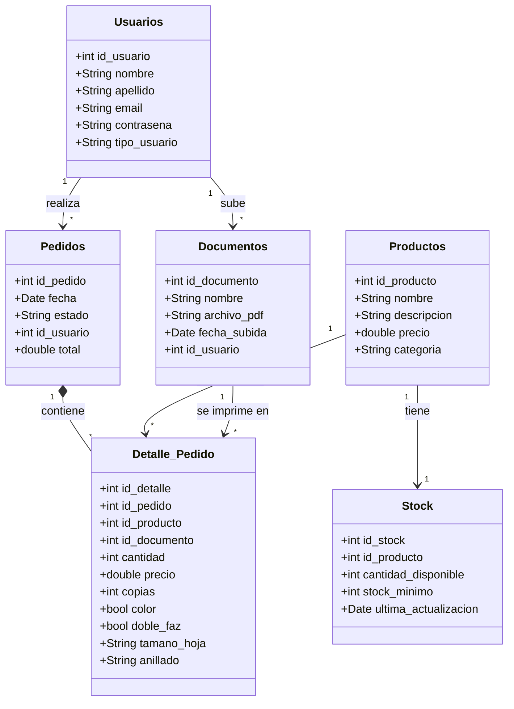

# Centro de Copias Web

Proyecto Integrador Final — Entrega previa (temática, alcance funcional y modelo de datos inicial)

## 1. Narrativa del Proyecto y Descripción del Problema

### Datos del Grupo

| Apellido | Nombre | Email |
|---|---|---|
| _Barroso_ | _Esteban_ | _Estebanbarroso037@gmail.com_ |
| _Zaleh_ | _Josemir_ | _josemirzaleh45@gmail.com_ |

### Título / Temática

**Centro de Copias Web** — Sistema de gestión de pedidos para un centro de fotocopiado e impresión.

### Descripción de la Problemática

Un centro de copias que atiende tanto a clientes particulares como a escuelas recibe pedidos de forma manual (de manera presencial o por mensajes sueltos), lo que genera varios problemas:

- No hay un registro centralizado de qué documentos subió cada cliente ni qué pedidos se hicieron.
- Las opciones de impresión (copias, color, doble faz, tamaño de hoja, anillado) se acuerdan de palabra y es fácil que se pierdan o se confundan.
- No hay control de stock de los productos/insumos que se venden (hojas, carpetas, anillados, etc.), por lo que es común quedarse sin stock sin previo aviso.
- No existe un historial claro de pedidos por usuario ni un total calculado automáticamente.

### Propuesta de Solución

Se propone una aplicación web (MVC) que permita a los usuarios (clientes particulares y escuelas) registrarse, subir sus documentos en PDF, y generar pedidos que combinen:

- **Productos** del local (artículos de librería, insumos, etc.).
- **Impresión de documentos** propios, con sus opciones configurables (cantidad de copias, color o blanco y negro, doble faz, tamaño de hoja, anillado).

El sistema calcula el total del pedido, mantiene un registro de stock por producto y guarda el historial de documentos y pedidos de cada usuario, dando trazabilidad completa al proceso que hoy se maneja manualmente.

## 2. Modelo de Datos y Diagrama de Clases

### Diagrama de Clases

### Listado y Descripción de Entidades

| Entidad | Descripción |
|---|---|
| **Usuarios** | Representa a cualquier persona u organización que usa el sistema: clientes particulares, escuelas y administradores. Se distinguen por `tipo_usuario`. |
| **Documentos** | Archivos PDF subidos por un usuario para ser impresos. Cada documento pertenece a un único usuario. |
| **Productos** | Artículos que vende el centro de copias (insumos, librería, etc.), con precio y categoría. |
| **Stock** | Registro de la cantidad disponible de cada producto, con un umbral mínimo para alertar cuándo reponer. |
| **Pedidos** | Encabezado de una compra realizada por un usuario: fecha, estado y total. |
| **Detalle_Pedido** | Líneas de un pedido. Cada línea puede corresponder a un producto o a la impresión de un documento, con sus opciones de impresión (copias, color, doble faz, tamaño de hoja, anillado). |

### Descripción de Relaciones

- **Usuarios → Documentos (1 a N):** un usuario puede subir varios documentos, pero cada documento pertenece a un único usuario.
- **Usuarios → Pedidos (1 a N):** un usuario puede realizar varios pedidos a lo largo del tiempo.
- **Pedidos → Detalle_Pedido (composición, 1 a N):** un pedido se compone de una o más líneas de detalle; una línea de detalle no tiene sentido sin su pedido asociado.
- **Productos → Detalle_Pedido (1 a N):** un mismo producto puede aparecer en muchas líneas de distintos pedidos.
- **Documentos → Detalle_Pedido (1 a N):** un mismo documento puede imprimirse en más de un pedido (por ejemplo, si el cliente pide copias adicionales más adelante).
- **Productos → Stock (1 a 1):** cada producto tiene un único registro de stock asociado, que se actualiza con cada venta.
